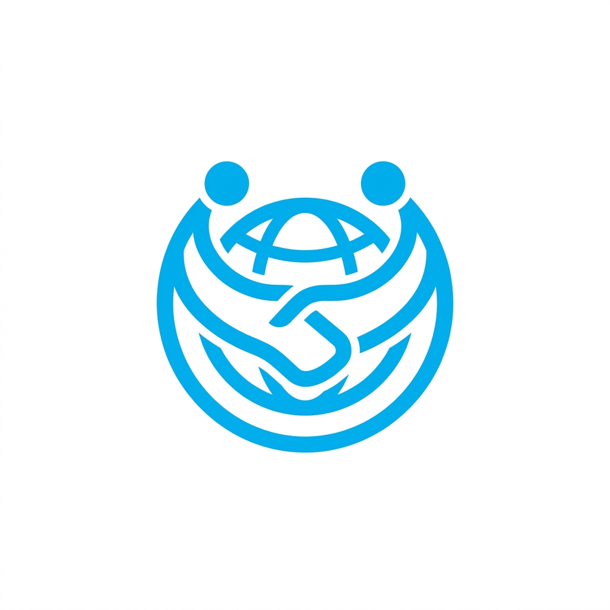
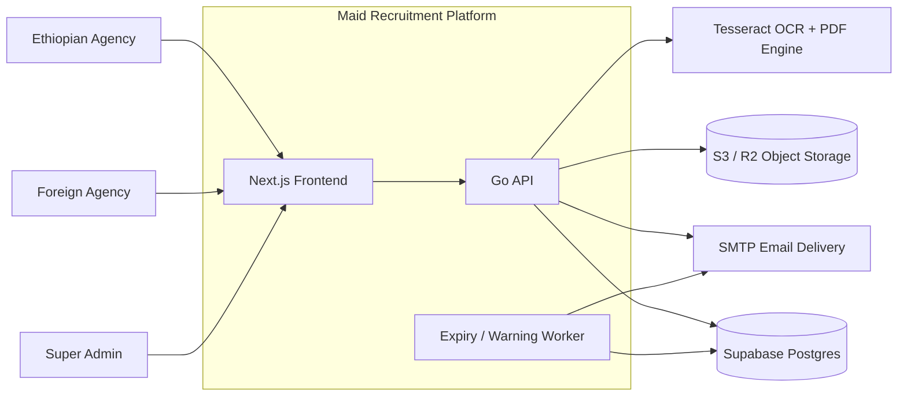
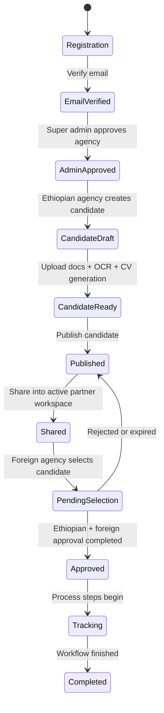
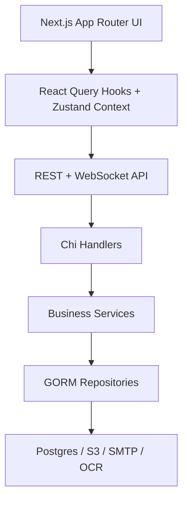
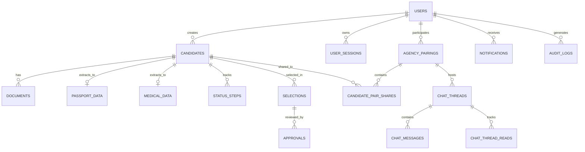
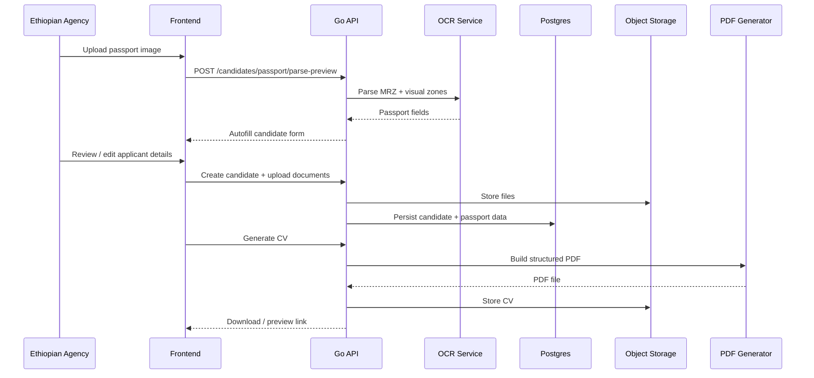
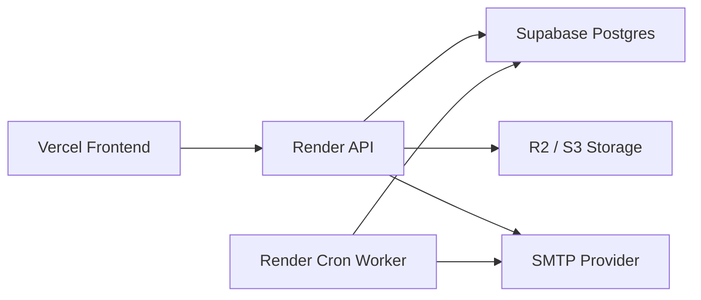

<p align="center">
  <picture>
    <source media="(prefers-color-scheme: dark)" srcset="frontend/public/branding/logo-dark.png">
    <source media="(prefers-color-scheme: light)" srcset="frontend/public/branding/logo-light.png">
    
  </picture>
</p>

<h1 align="center">Maid Recruitment Platform</h1>

<p align="center">
  A full-stack recruitment operations platform for Ethiopian agencies, foreign agencies, and platform administrators.
</p>

<p align="center">
  It combines agency onboarding, candidate publishing, partner workspaces, bilateral approvals, process tracking, OCR-assisted document intake, CV generation, notifications, audit visibility, and real-time chat in one production-oriented system.
</p>

---

## Overview

This repository powers a multi-actor recruitment workflow where:

- Ethiopian agencies register, verify email, create candidate profiles, upload passports/photos/videos, generate CVs, publish candidates, and manage process tracking.
- Foreign agencies work inside approved partner workspaces, review candidates, select them, upload employer-side documents, approve selections, and follow live progress.
- Super admins approve agencies, manage pairings, monitor audit activity, review platform analytics, and control platform settings.

The codebase is designed for real operational use, not just a demo UI. It includes:

- role-aware authentication and approval gates
- pairing-based data access between agencies
- OCR-assisted passport parsing
- medical/passport expiry intelligence
- CV generation with a structured PDF layout
- real-time notifications and agency chat
- audit logs, active sessions, and security hardening

---

## Why This Project Matters

Cross-border recruitment workflows usually break across spreadsheets, email threads, WhatsApp messages, document folders, and manual follow-up. This platform brings those steps into one coordinated operating system with explicit ownership, visibility, and control.

It is built around three ideas:

1. `Operational clarity`  
   Candidates, pairings, selections, approvals, and tracking steps all live in explicit states instead of informal side channels.

2. `Controlled collaboration`  
   Foreign agencies only see what has been shared into their active workspace, and each conversation or approval is tied to pairing context.

3. `Production realism`  
   The system handles email verification, admin approval, signed document access, RLS hardening, rate limiting, active sessions, and audit visibility.

---

## System Context



---

## Role Experience Map

| Actor | Main Responsibilities | Key Surfaces |
|---|---|---|
| Ethiopian agency | Candidate intake, uploads, OCR-assisted autofill, CV generation, publishing, sharing, approvals, tracking | `Candidates`, `Selections`, `Tracking`, `Partners`, `Chat`, `Settings` |
| Foreign agency | Review shared candidates, select candidates, upload employer package, approve selections, follow status, discuss in chat | `Candidates`, `Selections`, `Tracking`, `Partners`, `Chat` |
| Super admin | Approve agencies, manage pairings, audit activity, review analytics, configure platform behavior | `Admin Dashboard`, `Pending Approvals`, `Agencies`, `Pairings`, `Audit Logs`, `Settings` |

---

## End-to-End Recruitment Lifecycle



---

## Core Capabilities

### 1. Agency onboarding and trust gates

- registration for Ethiopian and foreign agencies
- email verification before the workflow continues
- admin approval and rejection
- platform-level settings and maintenance controls
- password reset and change-password flows
- active session tracking

### 2. Partner workspace model

- agencies do not operate in a flat public marketplace
- access is mediated through approved pairings
- candidate visibility is scoped to the selected workspace
- Ethiopian agencies can control sharing behavior and default partner preferences

### 3. Candidate operations

- create and edit rich candidate profiles
- upload passport, full-body photo, video interview, and supporting documents
- passport OCR for autofill assistance
- manual applicant-detail editing before CV generation
- structured CV PDF generation
- direct download and preview flows

### 4. Selection and approval engine

- foreign agency selection flow
- dual approval process
- employer contract and employer ID upload
- selection expiry logic
- clear approval state transitions

### 5. Process tracking and alerts

- checklist-style tracking steps
- medical document support
- smart alerts for deadlines and document expiry
- notification center plus websocket delivery

### 6. Admin operations

- agency approval queue
- agency login audit views
- pairings management
- candidates and selections oversight
- platform settings

### 7. Real-time collaboration

- pairing-scoped workspace chat
- candidate-scoped conversation threads
- notification websocket support
- unread summaries and thread tracking

---

## Architecture at a Glance



### Backend structure

The Go backend follows a clear layering model:

- `handler` for HTTP/WebSocket boundaries
- `service` for business rules and workflow orchestration
- `repository` for persistence
- `domain` for core models and contracts
- `jobs` for background expiry and warning processing

### Frontend structure

The Next.js frontend is organized around:

- App Router pages by role and workflow
- React Query hooks for data fetching and mutation
- Zustand for pairing/auth view state
- reusable dashboard/admin/shared UI components

---

## Domain Model Snapshot



---

## Key Workflow: OCR-Assisted Candidate Intake



---

## Key Workflow: Pairing, Selection, Approval, and Tracking

```mermaid
flowchart LR
    A["Ethiopian agency publishes candidate"] --> B["Candidate shared into partner workspace"]
    B --> C["Foreign agency reviews candidate"]
    C --> D["Foreign agency selects candidate"]
    D --> E["Employer package uploaded"]
    E --> F["Dual approval completed"]
    F --> G["Tracking begins"]
    G --> H["Medical / visa / flight / deployment steps"]
    H --> I["Completion + notifications + audit history"]
```



---

## Repository Layout

```text
.
+-- cmd
|   +-- adminseed        # bootstrap the first admin
|   +-- api              # main HTTP + websocket server
|   +-- devmigrate       # local migration helper
|   `-- expiryworker     # scheduled expiry / warning worker
+-- docs
|   +-- deployment.md
|   `-- testing-guide.md
+-- frontend             # Next.js 14 application
+-- internal
|   +-- config
|   +-- domain
|   +-- handler
|   +-- jobs
|   +-- middleware
|   +-- ocr
|   +-- repository
|   `-- service
+-- migrations           # SQL migrations
+-- scripts              # deployment / OCR helpers
+-- Makefile
`-- render.yaml
```

---

## Technology Stack

### Backend

- `Go 1.25`
- `Chi` for routing
- `GORM` for persistence
- `PostgreSQL` on Supabase
- `Gorilla WebSocket` for live notifications/chat
- `gofpdf` for CV generation
- `Tesseract OCR` for passport parsing
- `robfig/cron` for worker scheduling

### Frontend

- `Next.js 14`
- `React 18`
- `TypeScript`
- `Tailwind CSS`
- `TanStack Query`
- `Zustand`
- `Radix UI`
- `next-themes`

### Infrastructure

- `Vercel` for the frontend
- `Render` for API + cron worker
- `Supabase Postgres` for the primary database
- `S3 / R2` compatible storage for files and generated CVs
- `SMTP` for transactional email

---

## Security and Production Hardening

This repo includes meaningful production hardening, not just application features:

- Supabase RLS enabled on sensitive public tables
- service-role-only policies for protected backend-managed tables
- short-lived signed access patterns for sensitive document delivery
- email verification before agency workflow continuation
- rate limiting on login, reset, verification, OCR preview, chat, and websocket routes
- active session tracking and revocation
- admin setup tokens instead of loose temporary credentials
- audit logging for admin and agency access patterns
- cookie-based authenticated sessions instead of browser-stored bearer tokens

---

## Deployment Topology



The repo is already prepared for this topology in:

- [render.yaml](./render.yaml)
- [docs/deployment.md](./docs/deployment.md)

---

## Local Development

### 1. Configure environment

Copy:

- [`./.env.example`](./.env.example) -> `.env`
- [`./frontend/.env.example`](./frontend/.env.example) -> `frontend/.env.local`

Fill in:

- database credentials
- storage credentials
- SMTP credentials
- app URLs
- JWT secret

### 2. Run migrations

```bash
make migrate-up
```

### 3. Start the API

```bash
make run-api
```

### 4. Start the frontend

```bash
cd frontend
npm install
npm run dev
```

### 5. Optional worker

```bash
make run-expiry-worker
```

---

## Useful Commands

### Backend

```bash
make run-api
make run-expiry-worker
make build-api
make build-expiry-worker
make migrate-up
make migrate-down
make test
```

### Frontend

```bash
cd frontend
npm install
npm run dev
npm run build
npm run lint
npx tsc --noEmit
```

---

## Testing Strategy

The project already includes:

- backend unit and service tests
- frontend type-safety and production build verification
- end-to-end scenario documentation for the recruitment lifecycle

### Main checks

```bash
go test ./...
```

```bash
cd frontend
npx tsc --noEmit
npm run build
```

### End-to-end guide

See:

- [docs/testing-guide.md](./docs/testing-guide.md)

That guide walks through:

- happy-path recruitment
- rejection flows
- expiry flows
- authorization tests
- edge-case validation

---

## API Surface Highlights

Key route groups include:

- `/api/v1/auth`
- `/api/v1/admin`
- `/api/v1/candidates`
- `/api/v1/selections`
- `/api/v1/notifications`
- `/api/v1/chat`
- `/api/v1/dashboard`
- `/api/v1/users`
- `/api/v1/ws/notifications`
- `/api/v1/ws/chat`

Health check:

- `GET /api/v1/health`

---

## What Makes This Repository Showcase-Worthy

This project is a strong showcase because it demonstrates more than CRUD:

- multi-tenant role-aware workflow design
- operational state machines, not just forms
- OCR integration tied to real business outcomes
- PDF generation and document lifecycle handling
- pairing-scoped data access and collaboration
- admin governance plus audit visibility
- production deployment and security hardening
- real-time chat and notifications in a business workflow context

It tells a system-design story, not only a UI story.

---

## Documentation

- [Deployment Guide](./docs/deployment.md)
- [Testing Guide](./docs/testing-guide.md)

---

## Closing Note

If you are reviewing this repository as a portfolio project, the best way to read it is to follow the lifecycle:

`agency onboarding -> pairing -> candidate intake -> OCR -> CV generation -> sharing -> selection -> approval -> tracking -> alerts -> chat -> admin oversight`

That chain is where the system design value really shows.
